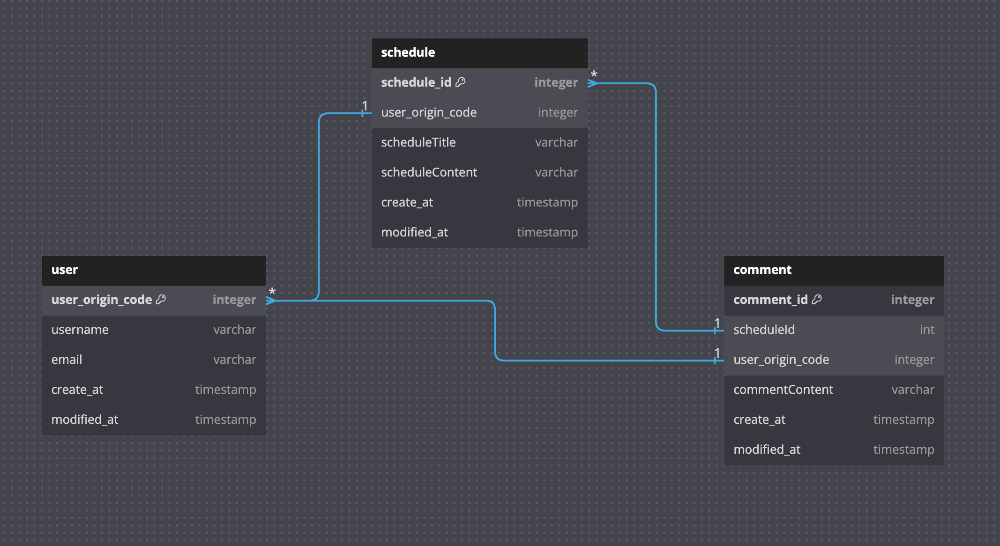

-. API 명세

    일정 관련
    1. 일정 등록
    기능 : 일정등록
    Method : POST
    URL : /api/schedule
    reponse : 등록정보

    2. 일정 조회
    기능 : 일정조회
    Method : GET
    URL : /api/schedule/{scheduleId}
    reponse : 단건응답정보

    3. 일정 수정
    기능 : 일정수정
    Method : PUT
    URL : /api/schedule/{scheduleId}
    reponse : 수정정보

    4. 일정 삭제
    기능 : 일정삭제
    Method : DELETE
    URL : /api/schedule/{scheduleId}
    reponse : -
    
    댓글 관련
    1. 댓글 등록
    기능 : 댓글 등록
    Method : POST
    URL : /api/comment
    response : 등록정보

    2. 댓글 단건 조회
    기능 : 댓글 단건 조회
    Method : GET
    URL : /api/comment/{commentId}
    reponse : 단건 응답 정보
    
    3. 댓글 전체 조회
    기능 : 댓글 전체 조회
    Method : GET
    URL : /api/comment
    reponse : 다건 응답 정보

    4. 댓글 수정
    기능 : 댓글 수정
    Method : PUT
    URL : /api/comment/{commentId}
    reponse : 수정정보

    5. 댓글 삭제
    기능 : 댓글 삭제
    Method : DELETE
    URL : /api/comment/{commendId}
    response : -

    유저 관련
    1. 유저 등록
    기능 : 유저 등록
    Method : POST
    URL : /api/user
    response : 등록정보

    2. 유저 단건 조회
    기능 : 유저 단건 조회
    Method : GET
    URL : /api/user/{userId}
    reponse : 단건 응답 정보
    
    3. 유저 전체 조회
    기능 : 유저 전체 조회
    Method : GET
    URL : /api/user
    reponse : 다건 응답 정보

    4. 유저 수정
    기능 : 유저 수정
    Method : PUT
    URL : /api/user/{userId}
    reponse : 수정정보

    5. 유저 삭제
    기능 : 유저 삭제
    Method : DELETE
    URL : /api/user/{userId}
    response : -

-. ERD
